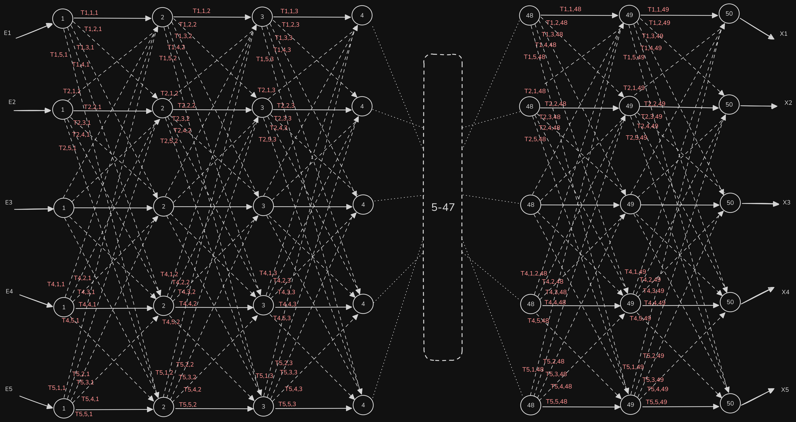
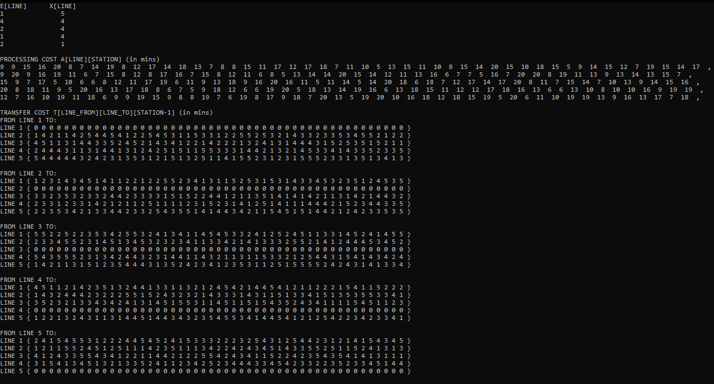
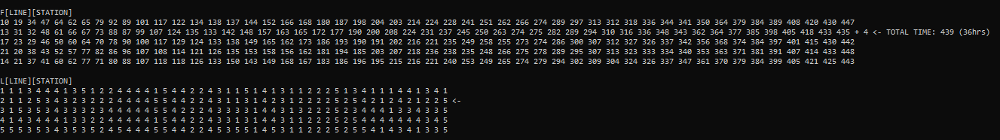
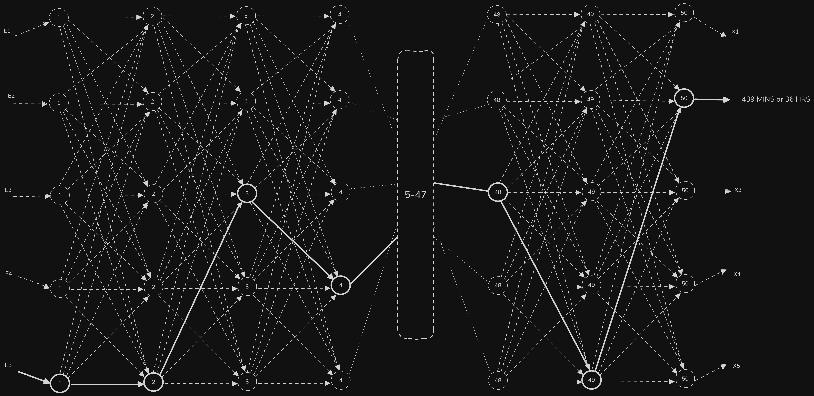
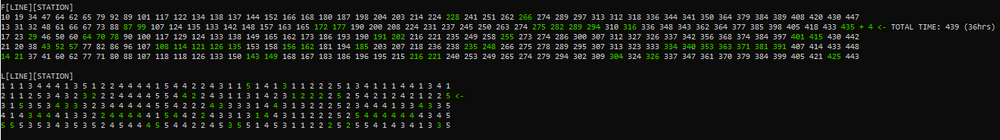

# CSC-321 Assembly Line Scheduling Problem: Dynamic Programming

## Overview

> A multi-line assembly system comprising 5 parallel assembly lines and 50 sequential stations. Each job is scheduled considering specific entry and exit times for each line, processing times at every station, and transfer times between lines at each station.

This Scheduling Algorithm uses dynamic programming technique, It minimizes the total production time while maximizing the utilization of assembly resources.

It is written in C++. Job Scheduling Simulation uses the given real-life datasets [transfer_times.csv](./data/transfer_times.csv), [entry_exit_times.csv](./data/entry_exit_times.csv), [processing_times.csv](./data/processing_times.csv)

## How it works

Here's the diagram of given problem:

-   There are five assembly lines, numbered $𝒊 = 1, 2, 3, 4, 5$.
-   Each assembly line has 𝒏 stations, numbered $𝒋 = 1, 2,…, 50$.
-   We denote the $𝒋^{𝒕𝒉}$ station on line 𝒊 by $𝑺_{(𝒊,𝒋)}$.
-   Corresponding stations $𝑺_{(𝟏,𝒋)}$, $𝑺_{(2,𝒋)}$, $𝑺_{(3,𝒋)}$, $𝑺_{(4,𝒋)}$, $𝑺_{(5,𝒋)}$ perform the same function but can take different amounts of time (Processing Time) $𝒂_{(𝟏,𝒋)}$, $𝒂_{(2,𝒋)}$, $𝒂_{(3,𝒋)}$, $𝒂_{(4,𝒋)}$, $𝒂_{(5,𝒋)}$; Generally $𝑺_{(𝒊,𝒋)}$ have $𝒂_{(𝒊,𝒋)}$ Processing Time.
-   $e_𝒊$ and $x_𝒊$ is Entry & Exit time.
-   After going through a station, a chassis can either:
    -   stay on same line at no cost, or
    -   transfer from line $k$ to other line $i$: cost after $𝑺_{(𝒊,𝒋)}$ is $𝑻_{(k,𝒊,𝒋)}$ for $k,𝒊= 1, 2, 3, 4, 5$ and $𝒋= 1, 2,…, 49$

Optimized Assembly Line Scheduling Algorithm is given as follows,

**_Base Case:_**
$f_i[1] = e_i + a_{i,1}$

**_General Case:_**
$f_i[j] = \min_{k=1}^{5}(f_i[j−1] + a_{i,j},f_k[j−1] + t_{k,i,j-1} + a_{i,j})$

-   Base case: $𝒋=𝟏, 𝒊=1, 2, 3, 4, 5$ (getting through station $1$)
-   General Case: $𝑗 = 2, 3, …, 50$ and $𝑖 = 1, 2, 3, 4, 5$ - Recursive solution

$$
f_i[j] = \begin{cases} e_i + a_{i,1} & \text{if } j = 1, \\ \min_{k=1}^{5}(f_i[j−1] + a_{i,j},f_k[j−1] + t_{k,i,j-1} + a_{i,j})  & \text{if } j \geq 2 \end{cases} ;
\ Where\ i\ =\ 1, 2, 3, 4, 5
$$

-   $𝒇_𝒊 [𝒋]$: the fastest time to get from the starting point through station $𝑺_{(𝒊,𝒋)}$.

$$
f_1[j] =
\begin{cases}
e_1 + a_{1,1} & \text{if } j = 1, \\
\min(f_1[j-1] + a_{1,j},\ f_2[j-1] + t_{2,1,j-1} + a_{1,j}),\ f_3[j-1] + t_{3,1,j-1} + a_{1,j},\ f_4[j-1] + t_{4,1,j-1} + a_{1,j},\ f_5[j-1] + t_{5,1,j-1} + a_{1,j})  & \text{if } j \geq 2
\end{cases}
$$

$$
f_2[j] =
\begin{cases}
e_2 + a_{2,1} & \text{if } j = 1, \\
\min(f_2[j-1] + a_{2,j},\ f_1[j-1] + t_{1,2,j-1} + a_{2,j}),\ f_3[j-1] + t_{3,2,j-1} + a_{2,j},\ f_4[j-1] + t_{4,2,j-1} + a_{2,j},\ f_5[j-1] + t_{5,2,j-1} + a_{2,j}) & \text{if } j \geq 2
\end{cases}
$$

$$
f_3[j] =
\begin{cases}
e_1 + a_{1,1} & \text{if } j = 1, \\
\min(f_3[j-1] + a_{3,j},\ f_1[j-1] + t_{1,3,j-1} + a_{3,j}),\ f_2[j-1] + t_{2,3,j-1} + a_{3,j},\ f_4[j-1] + t_{4,3,j-1} + a_{3,j},\ f_5[j-1] + t_{5,3,j-1} + a_{3,j})  & \text{if } j \geq 2
\end{cases}
$$

$$
f_4[j] =
\begin{cases}
e_2 + a_{2,1} & \text{if } j = 1, \\
\min(f_4[j-1] + a_{4,j},\ f_1[j-1] + t_{1,4,j-1} + a_{4,j}),\ f_2[j-1] + t_{2,4,j-1} + a_{4,j},\ f_3[j-1] + t_{3,4,j-1} + a_{4,j},\ f_5[j-1] + t_{5,4,j-1} + a_{4,j}) & \text{if } j \geq 2
\end{cases}
$$

$$
f_5[j] =
\begin{cases}
e_2 + a_{2,1} & \text{if } j = 1, \\
\min(f_5[j-1] + a_{5,j},\ f_1[j-1] + t_{1,5,j-1} + a_{5,j}),\ f_2[j-1] + t_{2,5,j-1} + a_{5,j},\ f_3[j-1] + t_{3,5,j-1} + a_{5,j},\ f_4[j-1] + t_{4,5,j-1} + a_{5,j}) & \text{if } j \geq 2
\end{cases}
$$

 

$$f^∗  = \min_{i=1}^{5}(f_i [50] + x_i)$$

$$f^* = \min(f_1[50] + x_1,\ f_2[50] + x_2,\ f_3[50] + x_3,\ f_4[50] + x_4,\ f_5[50] + x_5)$$

-   $𝒇^∗$: the fastest time to get through the entire factory

## Parsed Data and Schedule Simulation

Storing the parsed data into 2D and 3D Arrays and printing it in CLI\
Parsed Data:

Scheduled:

$$
$$
